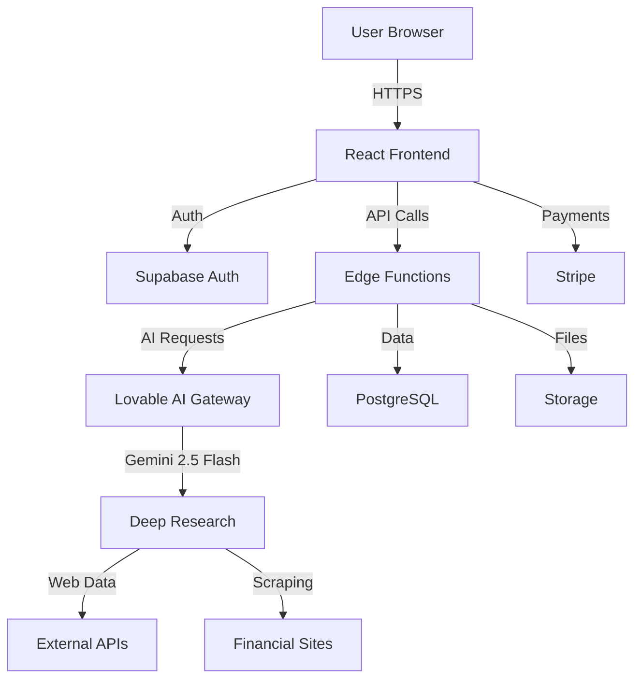

# Cheggie AI - Product Requirements Document

## Executive Summary

**Product Name:** Cheggie AI  
**Version:** 1.0  
**Last Updated:** January 2025  
**Status:** Development Ready

### Vision
Cheggie AI democratizes professional financial analysis by providing AI-powered stock and business research that rivals Wall Street analysts—but faster, cheaper, and more accessible.

### Mission
Make institutional-grade financial research available to retail investors, startups, and businesses across Serbian, English, and Spanish-speaking markets.

---

## 1. Market Analysis & Problem Statement

### 1.1 Target Markets
- **Primary:** Retail investors (age 25-55) in US, Serbia, Spain
- **Secondary:** Small business owners, financial advisors, startup founders
- **Tertiary:** Finance students, content creators in finance niche

### 1.2 Pain Points Identified

Based on Reddit r/stocks, r/investing, r/financialindependence analysis:

| Pain Point | Current State | Our Solution |
|------------|---------------|--------------|
| **Cost Barrier** | Professional research costs $500-5000/month | Free tier + $49/month pro plan |
| **Time Intensive** | Manual research takes 4-8 hours per stock | AI analysis in <1 minute |
| **Information Overload** | 100+ sources to check manually | AI aggregates and synthesizes all sources |
| **Language Barriers** | Most research only in English | Native Serbian and Spanish support |
| **No Actionable Insights** | Data without context | Executive summaries with clear recommendations |

### 1.3 Competitive Landscape

**Direct Competitors:**
- Bloomberg Terminal ($24,000/year) - Enterprise only
- Morningstar Premium ($250/year) - Limited analysis depth
- Seeking Alpha ($240/year) - Opinion-based, not data-driven

**Indirect Competitors:**
- ChatGPT/Claude - Generic, not finance-optimized
- Yahoo Finance - Free but basic

**Our Differentiators:**
1. ✅ Multi-agent AI architecture (simultaneous analysis)
2. ✅ Multilingual (EN/SR/ES) with cultural context
3. ✅ Affiliate program for viral growth
4. ✅ Real-time sentiment + expert opinion fusion
5. ✅ Professional PDF reports

---

## 2. Product Architecture

### 2.1 Technology Stack

**Frontend:**
- React 18 + TypeScript
- Vite (build tool)
- Tailwind CSS + shadcn/ui
- Framer Motion (animations)
- react-i18next (multilingual)

**Backend (Lovable Cloud):**
- PostgreSQL (user data, subscriptions)
- Supabase Auth (authentication)
- Edge Functions (AI orchestration)
- File Storage (PDF reports)

**AI Layer:**
- Lovable AI Gateway (Google Gemini 2.5 Flash)
- Web scraping for real-time data
- Multi-agent orchestration
- Sentiment analysis

**Payments & Monetization:**
- Stripe (subscriptions + one-off)
- Affiliate system (custom built)

**Deployment:**
- Vercel (frontend)
- Supabase Cloud (backend)
- CDN for assets

### 2.2 System Architecture



### 2.3 Data Flow: Analysis Request

1. **User Input:** Stock ticker, analysis type, parameters
2. **AI Planning:** Multi-agent system creates task breakdown
3. **Parallel Execution:**
   - Agent 1: Fundamental analysis
   - Agent 2: News aggregation
   - Agent 3: Sentiment analysis
   - Agent 4: Competitor benchmarking
   - Agent 5: Risk assessment
4. **Synthesis:** AI combines all findings
5. **Report Generation:** PDF + dashboard view
6. **Storage:** Save to user's reports library

---

## 3. Feature Specifications

### 3.1 MVP Features (Phase 1)

#### F1: User Authentication
- **User Stories:**
  - As a new user, I can sign up with email/password
  - As a returning user, I can log in securely
  - As a user, I can reset my password
- **Tech:** Supabase Auth
- **i18n:** Full SR/EN/ES support

#### F2: Stock Analysis
- **Input Parameters:**
  - Stock ticker (required)
  - Analysis depth (quick/standard/deep)
  - Investment horizon (short/medium/long)
  - Risk tolerance (low/medium/high)
- **Output:**
  - Executive summary (2-3 paragraphs)
  - Financial metrics table
  - Growth projections
  - Risk analysis
  - Competitor comparison
  - Recommendation (buy/hold/sell with confidence %)
- **Format:** Interactive dashboard + downloadable PDF

#### F3: Language Switching
- **Supported:** EN, SR, ES
- **Scope:** Full UI + AI responses
- **Persistence:** User preference saved

#### F4: Subscription Management
- **Tiers:**
  - Free: 3 analyses/month
  - Pro ($49/month): 50 analyses/month, priority AI
  - Enterprise: Custom pricing, unlimited
- **Tech:** Stripe Billing Portal integration

#### F5: Affiliate Program
- **Features:**
  - Unique referral links
  - 20% recurring commission
  - Dashboard with earnings tracking
- **Payouts:** Monthly via Stripe Connect

### 3.2 Phase 2 Features (Q2 2025)

- Business plan generator
- Portfolio optimization tool
- Watchlist with alerts
- API access for developers
- Mobile app (React Native)

### 3.3 Phase 3 Features (Q3 2025)

- Video/audio analysis summaries
- Team collaboration features
- White-label solution
- Custom integrations

---

## 4. User Experience Design

### 4.1 Design System

**Color Palette:**
- Primary: Deep Blue `hsl(217 91% 15%)` - Trust, professionalism
- Accent: Cyan `hsl(199 89% 48%)` - Innovation, clarity
- Success: Green `hsl(142 76% 36%)` - Growth, positive signals
- Warning: Orange `hsl(38 92% 50%)` - Caution, alerts

**Typography:**
- Headings: System font stack (optimized for speed)
- Body: Inter-based fallback
- Code/Data: Monospace

**Components:**
- All based on shadcn/ui with custom variants
- Finance-optimized: data cards, charts, report viewers

### 4.2 Key User Flows

**Flow 1: New User Onboarding**
```
Landing Page → Sign Up → Email Verify → Language Select → Quick Tutorial → First Free Analysis
```

**Flow 2: Analysis Request**
```
Dashboard → New Analysis → Input Ticker → Set Parameters → AI Processing (live view) → View Report → Download PDF
```

**Flow 3: Upgrade to Pro**
```
Usage Limit Reached → Pricing Comparison → Select Plan → Stripe Checkout → Confirmation → Pro Dashboard
```

---

## 5. Monetization Strategy

### 5.1 Revenue Streams

1. **Subscriptions** (Primary - 70% revenue)
   - Free → Pro conversion rate target: 8%
   - Pro → Enterprise: 5%
   
2. **Pay-per-Analysis** (Secondary - 20% revenue)
   - $9 per deep analysis for free users
   
3. **Affiliate Commission** (10% revenue)
   - 20% recurring on referred users
   - Payouts create marketing army

### 5.2 Pricing Rationale

**Free Tier:**
- 3 analyses/month = enough to evaluate quality
- No credit card required = low friction signup
- Gateway to paid conversion

**Pro Tier ($49/month):**
- Priced 80% below Bloomberg Terminal value
- Aligns with Morningstar/Seeking Alpha range
- Sweet spot for serious retail investors

**Enterprise:**
- Custom = flexibility for institutions
- Value-based pricing (not cost-plus)

### 5.3 Unit Economics

**Target Metrics:**
- CAC (Customer Acquisition Cost): $45
- LTV (Lifetime Value - Pro): $588 (12 months avg retention)
- LTV:CAC Ratio: 13:1
- Gross Margin: 85%

---

## 6. Growth & Marketing Strategy

### 6.1 Distribution Channels

**Organic (Priority):**
1. Reddit presence (r/stocks, r/investing, r/financialindependence)
2. SEO for "AI stock analysis", "dividend stock research"
3. YouTube tutorials (Serbian finance creators)
4. Twitter finance community

**Paid (Post-PMF):**
1. Google Ads (finance keywords)
2. LinkedIn Ads (B2B for Enterprise)
3. Podcast sponsorships

**Viral (Affiliate-Driven):**
1. 20% commission incentivizes sharing
2. Leaderboard gamification
3. Co-marketing with top affiliates

### 6.2 Content Strategy

**Blog Topics (SEO-Optimized):**
- "Best Dividend Stocks 2025" (monthly update)
- "How to Analyze Stocks with AI"
- "Serbian Stock Market Guide" (SR content)

**Video Content:**
- Platform walkthroughs (EN/SR/ES)
- Case studies: "I analyzed 50 stocks in 1 hour"
- Behind-the-scenes: AI research process

### 6.3 Launch Plan

**Pre-Launch (Week -4 to 0):**
- Beta access waitlist
- Reddit AMAs in finance subs
- Influencer partnerships (micro-influencers)

**Launch Week:**
- ProductHunt submission
- Press release (Serbian tech media)
- Free Pro access for first 100 users (7 days)

**Post-Launch (Month 1-3):**
- User feedback iteration
- Case study collection
- Affiliate program activation

---

## 7. Technical Specifications for Development

### 7.1 Frontend Component Architecture

**Page Structure:**
```
/
├── / (landing - public)
├── /auth (sign in/up - public)
├── /dashboard (main app - auth required)
│   ├── /new-analysis
│   ├── /reports
│   ├── /settings
│   └── /affiliate
├── /pricing (public)
└── /blog (public)
```

**Core Components:**
```typescript
// Navigation
<Navigation /> // Top navbar with language switcher
<Sidebar /> // Dashboard sidebar (collapsible)

// Landing Page
<Hero /> // Animated hero with CTA
<Features /> // 4-card grid
<Pricing /> // 3-tier pricing table
<Footer /> // Links + copyright

// Analysis
<AnalysisForm /> // Ticker input + parameters
<LiveProgress /> // Multi-agent task viewer
<ReportViewer /> // Interactive report display
<PDFExporter /> // Download functionality

// Multilingual
<LanguageSwitcher /> // Dropdown (EN/SR/ES)
```

### 7.2 Database Schema

**users table:**
```sql
CREATE TABLE users (
  id UUID PRIMARY KEY DEFAULT gen_random_uuid(),
  email TEXT UNIQUE NOT NULL,
  created_at TIMESTAMPTZ DEFAULT NOW(),
  language TEXT DEFAULT 'en' CHECK (language IN ('en', 'sr', 'es')),
  subscription_tier TEXT DEFAULT 'free' CHECK (tier IN ('free', 'pro', 'enterprise')),
  analyses_used_this_month INTEGER DEFAULT 0,
  stripe_customer_id TEXT,
  affiliate_code TEXT UNIQUE
);
```

**analyses table:**
```sql
CREATE TABLE analyses (
  id UUID PRIMARY KEY DEFAULT gen_random_uuid(),
  user_id UUID REFERENCES users(id) ON DELETE CASCADE,
  ticker TEXT NOT NULL,
  analysis_type TEXT NOT NULL,
  parameters JSONB,
  result JSONB,
  pdf_url TEXT,
  created_at TIMESTAMPTZ DEFAULT NOW(),
  cost_credits INTEGER DEFAULT 1
);
```

**affiliates table:**
```sql
CREATE TABLE affiliates (
  id UUID PRIMARY KEY DEFAULT gen_random_uuid(),
  user_id UUID REFERENCES users(id) ON DELETE CASCADE,
  code TEXT UNIQUE NOT NULL,
  total_referrals INTEGER DEFAULT 0,
  total_earnings DECIMAL(10,2) DEFAULT 0,
  payout_email TEXT,
  created_at TIMESTAMPTZ DEFAULT NOW()
);
```

**referrals table:**
```sql
CREATE TABLE referrals (
  id UUID PRIMARY KEY DEFAULT gen_random_uuid(),
  affiliate_id UUID REFERENCES affiliates(id),
  referred_user_id UUID REFERENCES users(id),
  subscription_start TIMESTAMPTZ,
  status TEXT CHECK (status IN ('active', 'churned')),
  commission_rate DECIMAL(3,2) DEFAULT 0.20
);
```

### 7.3 Edge Function: AI Analysis

**File:** `supabase/functions/analyze-stock/index.ts`

```typescript
import { serve } from 'https://deno.land/std@0.168.0/http/server.ts';

serve(async (req) => {
  const { ticker, analysisType, parameters, language } = await req.json();
  
  const LOVABLE_API_KEY = Deno.env.get('LOVABLE_API_KEY');
  
  // Step 1: Planning phase
  const planningPrompt = `
    You are a financial analysis AI. Create a detailed analysis plan for ${ticker}.
    Analysis type: ${analysisType}
    User parameters: ${JSON.stringify(parameters)}
    Language: ${language}
    
    Break down into 5-7 concurrent subtasks.
  `;
  
  const planResponse = await fetch('https://ai.gateway.lovable.dev/v1/chat/completions', {
    method: 'POST',
    headers: {
      'Authorization': `Bearer ${LOVABLE_API_KEY}`,
      'Content-Type': 'application/json',
    },
    body: JSON.stringify({
      model: 'google/gemini-2.5-flash',
      messages: [{ role: 'user', content: planningPrompt }],
    }),
  });
  
  const plan = await planResponse.json();
  
  // Step 2: Execute subtasks (simplified - actual implementation uses parallel agents)
  const tasks = parsePlan(plan.choices[0].message.content);
  const results = await Promise.all(tasks.map(task => executeTask(task, ticker)));
  
  // Step 3: Synthesize report
  const synthesisPrompt = `
    Based on these research results for ${ticker}:
    ${JSON.stringify(results)}
    
    Create a professional financial analysis report in ${language}.
    Include: executive summary, metrics, risks, recommendation.
  `;
  
  const reportResponse = await fetch('https://ai.gateway.lovable.dev/v1/chat/completions', {
    method: 'POST',
    headers: {
      'Authorization': `Bearer ${LOVABLE_API_KEY}`,
      'Content-Type': 'application/json',
    },
    body: JSON.stringify({
      model: 'google/gemini-2.5-flash',
      messages: [{ role: 'user', content: synthesisPrompt }],
    }),
  });
  
  const report = await reportResponse.json();
  
  // Step 4: Generate PDF (placeholder - actual uses PDF lib)
  const pdfUrl = await generatePDF(report.choices[0].message.content);
  
  return new Response(JSON.stringify({ 
    report: report.choices[0].message.content,
    pdfUrl 
  }));
});
```

### 7.4 Stripe Integration

**Subscription Setup:**
```typescript
// Stripe webhook handler: supabase/functions/stripe-webhook/index.ts
serve(async (req) => {
  const sig = req.headers.get('stripe-signature');
  const body = await req.text();
  
  let event;
  try {
    event = stripe.webhooks.constructEvent(body, sig, webhookSecret);
  } catch (err) {
    return new Response(`Webhook Error: ${err.message}`, { status: 400 });
  }
  
  switch (event.type) {
    case 'customer.subscription.created':
      await updateUserTier(event.data.object.customer, 'pro');
      break;
    case 'customer.subscription.deleted':
      await updateUserTier(event.data.object.customer, 'free');
      break;
    case 'invoice.paid':
      await trackAffiliateCommission(event.data.object);
      break;
  }
  
  return new Response(JSON.stringify({ received: true }));
});
```

---

## 8. Success Metrics & KPIs

### 8.1 Product Metrics

| Metric | Target (Month 3) | Measurement |
|--------|------------------|-------------|
| **Signups** | 1,000 users | Google Analytics |
| **Free → Pro Conversion** | 8% | Database query |
| **Monthly Active Users** | 600 | Supabase analytics |
| **Analyses per User** | 5/month avg | Database aggregation |
| **Report Downloads** | 2,500/month | Storage logs |

### 8.2 Business Metrics

| Metric | Target (Month 6) | Formula |
|--------|------------------|---------|
| **MRR** | $4,000 | Stripe dashboard |
| **CAC** | <$45 | Ad spend / new customers |
| **LTV** | >$588 | Avg subscription * retention |
| **Churn Rate** | <5%/month | Cancelled / active |
| **Affiliate Revenue** | 10% of total | Commission payouts |

### 8.3 Technical Metrics

| Metric | Target | Tool |
|--------|--------|------|
| **API Response Time** | <2s for analysis | Supabase logs |
| **Uptime** | 99.9% | Vercel analytics |
| **Error Rate** | <0.1% | Sentry |
| **PDF Generation** | <5s | Custom timing |

---

## 9. Risks & Mitigation

### 9.1 Technical Risks

| Risk | Impact | Likelihood | Mitigation |
|------|--------|-----------|-----------|
| **AI API Rate Limits** | High | Medium | Implement queuing, upgrade plan |
| **Data Accuracy** | High | Low | Multi-source verification, disclaimers |
| **Security Breach** | Critical | Low | Regular audits, OWASP compliance |
| **Scaling Costs** | Medium | High | Monitor usage, optimize prompts |

### 9.2 Business Risks

| Risk | Impact | Likelihood | Mitigation |
|------|--------|-----------|-----------|
| **Low Conversion** | High | Medium | A/B test pricing, free trial |
| **Competitor Clone** | Medium | High | Fast iteration, brand loyalty |
| **Regulatory (Finance)** | Critical | Low | Legal review, disclaimers |
| **Market Downturn** | Medium | Medium | Diversify to business analysis |

---

## 10. Development Roadmap

### Phase 1: MVP (Weeks 1-4)
- [x] Design system setup
- [x] Multilingual configuration
- [x] Landing page
- [ ] Authentication (Lovable Cloud)
- [ ] Basic stock analysis
- [ ] Stripe billing
- [ ] Deploy to production

### Phase 2: Polish (Weeks 5-8)
- [ ] Advanced analysis features
- [ ] Affiliate system
- [ ] Email notifications
- [ ] SEO optimization
- [ ] Analytics integration

### Phase 3: Growth (Weeks 9-12)
- [ ] Content marketing launch
- [ ] API documentation
- [ ] Mobile optimization
- [ ] Performance optimization
- [ ] User feedback iteration

---

## 11. Appendix

### 11.1 Glossary

- **Deep Research:** Multi-agent AI analysis combining 5+ data sources
- **Analysis Credit:** Unit of usage (1 credit = 1 analysis)
- **Affiliate Code:** Unique tracking link for referrals

### 11.2 References

- Supabase Documentation: https://supabase.com/docs
- Lovable AI Gateway: https://docs.lovable.dev/features/ai
- Stripe Billing: https://stripe.com/docs/billing

### 11.3 Team & Stakeholders

- **Product Owner:** Cheggie AI Founder
- **Development:** Lovable AI Platform
- **Target Market:** Serbian/English/Spanish retail investors

---

**Document Version:** 1.0  
**Last Review:** January 2025  
**Next Review:** February 2025
